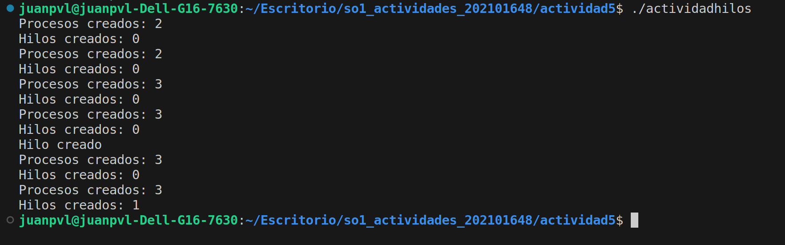

# Actividad 5
## Prueba de Procesos e hilos

### 202101648
### Juan Pedro Valle Lema

#### Ejecucion del programa

Usando el siguiente código como referencia, completar el programa para que sea ejecutable y responder las siguientes preguntas:

##### a) ¿Cuántos procesos únicos son creados?
##### b) ¿Cuántos hilos únicos son creados?

a) Se crearon 3 procesos unicos durante la ejecucion del programa, la funcion fork() es la que se encarga de esto,
tenemos un primero que se crea al inicio y sera el proceso principal y luego otros que se crearan como procesos hijos

b) Se crea un solo hilo unico en el momento en que se ejecuta la funcion pthread_create